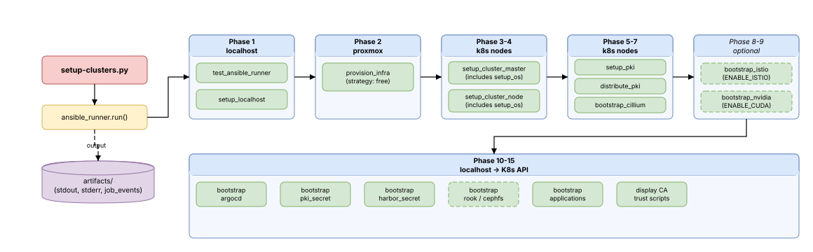

# Ansible Pipeline

## What It Does

Python entry points drive all cluster automation through Ansible Runner. Each one loads `.env`, cleans the `artifacts/` directory, and executes a specific playbook. There is no CI server — you run these scripts from your workstation and they orchestrate everything from VM creation to application deployment.



## Why It's Structured This Way

The pipeline is split into two independent lifecycles:

- **Infrastructure** (`setup-clusters.py`): Destructive, ~26 minutes, touches VMs and the Kubernetes cluster. You run this when building or rebuilding.
- **Applications** (`setup-applications.py`): Non-destructive, seconds, only uploads ArgoCD manifests. You run this during day-to-day development.

This separation means you can iterate on application configs without ever risking infrastructure state.

A third entry point, **`cleanup-clusters.py`**, reverses everything — destroying VMs, wiping storage, and removing local kubeconfig.

A utility script, **`expose-ca.py`**, re-displays the root CA trust setup instructions (the same output shown at the end of a full `setup-clusters.py` run) — useful if you missed the output or need to import the CA on another machine.

## Entry Points

### `setup-clusters.py` — Full Provisioning

Executes `setup_cluster.yaml` — the 16-play playbook that builds everything from scratch.

```bash
python3 setup-clusters.py    # ~26 minutes
```

- Loads `.env` via `python-dotenv`
- Adds `.venv/bin` to `PATH` (so `ansible_runner` can locate Ansible internally)
- Cleans `artifacts/` for fresh debug logs
- Prints execution stats and total time on completion

### `setup-applications.py` — Application Deployment

Executes `setup_applications.yaml` — two plays that upload ArgoCD manifests and optionally deploy Sveltos profiles.

```bash
python3 setup-applications.py    # Seconds
```

- Same cleanup/timing pattern as above
- No infrastructure changes, safe to run repeatedly
- Play 1: Applies the app-of-apps parent manifest; ArgoCD handles all downstream syncing
- Play 2 (conditional): Deploys Sveltos ClusterProfiles when `ENABLE_SVELTOS=true`

### `cleanup-clusters.py` — Teardown

Executes `cleanup_cluster.yaml` — destroys all VMs and cleans up Proxmox storage.

```bash
python3 cleanup-clusters.py
```

- Destroys VMs via Proxmox API
- Removes LVM thin pools, volume groups, physical volumes
- Wipes disk signatures for clean re-provisioning
- Removes local `~/.kube/config`

### `expose-ca.py` — Root CA Trust Scripts

Executes `expose_ca.yaml` — fetches the root CA from the running cluster and prints copy-paste ready import scripts.

```bash
python3 expose-ca.py    # Seconds, requires running cluster
```

- Reads `homelab-ca-secret` from cert-manager namespace via the Kubernetes API
- Prints the certificate in PEM format with OS-specific import scripts (Windows PowerShell, Linux, macOS)
- Useful when the `setup-clusters.py` output has scrolled away or importing the CA on a different machine
- Requires a running cluster with cert-manager deployed

---

## Playbook: `setup_cluster.yaml`

This is the main playbook. It runs 16 plays in sequence, each targeting specific host groups and executing one or more roles.

### Execution Flow

```
Play  1: localhost          → test_ansible_runner + setup_localhost
Play  2: proxmox            → provision_infra
Play  3: k8s-control        → setup_cluster_master (includes setup_os)
Play  4: k8s-nodes          → setup_cluster_node (includes setup_os)
Play  5: k8s-control        → setup_pki
Play  6: k8s (all nodes)    → distribute_pki
Play  7: k8s (all nodes)    → bootstrap_cillium
Play  8: k8s-control        → bootstrap_istio_ambient
Play  9: localhost           → bootstrap_nvidia_device_plugin
Play 10: localhost           → bootstrap_argocd
Play 11: localhost           → bootstrap_sveltos
Play 12: localhost           → bootstrap_pki_secret
Play 13: localhost           → bootstrap_harbor_secret
Play 14: localhost           → bootstrap_cephfs_storage_class / bootstrap_rook_ceph
Play 15: localhost           → bootstrap_applications
Play 16: localhost           → display root CA trust instructions
```

### Phase 1 — Local Preparation

**Hosts**: `localhost` · **Roles**: `test_ansible_runner`, `setup_localhost`

Validates that Ansible Runner is working, then prepares the control machine:

- Installs CLI tools: kubectl, Helm, Cilium CLI, Hubble CLI, and optionally istioctl (kubectl and Helm are installed from APT repositories via the `install_repo` utility role; Cilium CLI and Hubble CLI are downloaded from GitHub as tarballs via `unarchive` with `remote_src`; istioctl uses a `get_url` + `unarchive` split)
- Creates a Python venv (`venv_proxmox`) with `proxmoxer` for Proxmox API access
- Downloads the Ubuntu Server ISO and remasters it with cloud-init autoinstall configuration (injects GRUB menu entry, creates hybrid BIOS+UEFI bootable ISO using xorriso). The autoinstall includes `early-commands` that stabilize the virtio NIC before subiquity probes (NIC carrier wait, DHCP lease via `dhclient`, DNS verification), apt retry config for both the live installer (`early-commands` writes `Acquire::Retries` to the live system) and target system (`apt.conf` + `late-commands`)
- Pre-checks all configured Proxmox hosts, builds the ISO locally only if at least one host is missing it, then uploads to each host that needs it
- Discovers raw secondary disks on each Proxmox host independently (for Rook-Ceph OSDs)
- Creates LVM thin pools from secondary disks and calculates per-node disk allocation for each cluster

The ISO remaster is idempotent — if the autoinstall ISO already exists on all Proxmox hosts, the entire block is skipped.

### Phase 2 — VM Provisioning

**Hosts**: `proxmox` · **Role**: `provision_infra` · **Strategy**: `free` (parallel)

Creates VMs on Proxmox for every host defined in inventory:

- Resolves Proxmox API connection details from the `proxmox_cluster` map — each host's `vm_provision.proxmox_cluster` field (e.g., `cluster_1`) is used to look up the correct API host, user, password, node name, and storage
- Staggers VM creation with cluster-interleaved delays to avoid Proxmox VMID conflicts (e.g., cluster_1 hosts at 0s, 10s, 20s; cluster_2 hosts at 5s, 15s, 25s — ensuring same-cluster VMs are always well-separated). The `create_vm.py` script also retries with exponential backoff on VMID collision.
- Calls `create_vm.py` with full environment (CPU, memory, disk, network bridge, GPU PCI address for cuda nodes, secondary disk spec for infra-role worker nodes)
- Polls for IP assignment (`poll_for_ip.py`, 1200s timeout) — the VM boots from the autoinstall ISO and gets a DHCP address. If the poll times out (autoinstall failed or no DHCP lease), a `block/rescue` triggers an automatic retry: `reinstall_vm.py` sets `boot=ide2;scsi0` (ISO first) and `reboot=0` (VM halts on guest reboot instead of rebooting), stops the VM, starts it to re-run the autoinstall, waits for the VM to halt when the installer finishes, then reverts `boot=scsi0;ide2` and `reboot=1` while the VM is stopped (so changes apply immediately — Proxmox only applies config changes to stopped VMs, not as pending changes on running ones), and starts the VM from disk. A second 1200s IP poll follows the retry.
- Configures the OS: sets hostname, creates SSH user with passwordless sudo, deploys authorized keys
- Applies static IP via netplan template, waits for reconnection
- Cleans up: disables DHCP, removes the default `ubuntu` user, disables password authentication

GPU passthrough is automatic for nodes with `labels.compute: cuda` — the VM is created with `hostpci0` pointing to the configured PCI address and the machine type is set to Q35.

### Phase 3 — Control Plane Initialization

**Hosts**: `k8s-control` · **Role**: `setup_cluster_master`

Prepares the OS (via included `setup_os` role) and initializes the Kubernetes control plane:

**OS preparation** (`setup_os`):
- Disables swap, enables IP forwarding, reduces `net.ipv4.tcp_syn_retries` to 3 (faster mirror fallback during bootstrap)
- Installs CRI-O (container runtime) and kubeadm/kubelet (Kubernetes), both version-pinned
- Configures UFW firewall rules for Kubernetes ports, Cilium VXLAN/WireGuard, and node ports
- Optionally loads Ceph kernel module (`ENABLE_CEPH`) or installs NVIDIA drivers (`compute: cuda` nodes)

**Cluster initialization**:
- Optionally deploys kube-vip static pods for API server HA (only on new clusters when `K8S_VIP` is set — guarded by checking `admin.conf` on the primary control plane). The primary control plane mounts `super-admin.conf` (has `system:masters` in the client cert, works without RBAC during init); secondary control planes mount `admin.conf` (ClusterRoleBinding exists by the time they join). An explicit `vip_kubeconfig` env var points kube-vip at the mounted kubeconfig since static pods don't have service accounts.
- Runs `kubeadm init --skip-phases=addon/kube-proxy --control-plane-endpoint=<VIP>:6443 --upload-certs --ignore-preflight-errors=NumCPU` on the primary control plane (falls back to control-1 IP if no VIP is configured)
- Secondary control planes join via `kubeadm join --control-plane --ignore-preflight-errors=NumCPU` using a certificate key from the primary
- Fetches the admin kubeconfig to `~/.kube/config` on localhost
- Waits for the node to report Ready
- Applies declarative node labels and taints from inventory (removes stale labels/taints, adds missing ones)

Idempotent via `creates: /etc/kubernetes/admin.conf` — re-running skips the init if the cluster already exists. kube-vip deployment is guarded with `delegate_to: k8s-control-1` + `run_once: true` to ensure all nodes check the primary's state.

### Phase 4 — Worker Node Join

**Hosts**: `k8s-nodes` · **Role**: `setup_cluster_node`

Same OS preparation as the control plane, then joins each worker to the cluster:

- Generates a join token from the control plane (`kubeadm token create --print-join-command`)
- Runs the join command on each worker with `--ignore-preflight-errors=NumCPU` (idempotent via `creates: /etc/kubernetes/kubelet.conf`)
- Waits for the node to report Ready
- Applies node labels, protecting system-managed labels (`kubernetes.io/*`, `nvidia.com/*`, `accelerator`, `gpu-type`)
- Applies node taints from inventory (e.g., `role=infra:NoSchedule`, `role=platform:NoSchedule`), removing stale user-managed taints while preserving system taints (`kubernetes.io/*`, `k8s.io/*`, `nvidia.com/*`)

### Phase 5 — PKI Generation

**Hosts**: `k8s-control` · **Role**: `setup_pki`

Generates a two-tier CA hierarchy on the control plane node:

- **Root CA**: ECC secp384r1 key, self-signed certificate with 10-year validity. Private key stays on the control node filesystem and never leaves.
- **Intermediate CA**: ECC secp384r1 key, signed by root CA with 5-year validity and `pathlen:0` (cannot sign further sub-CAs).
- Fetches root CA certificate, intermediate certificate, and intermediate key to the Ansible controller (`/tmp/homelab-pki/`) for downstream plays.

All key generation uses `force: false` — re-runs skip generation if the files already exist.

### Phase 6 — PKI Distribution & Registry Mirrors

**Hosts**: `k8s` (all nodes) · **Role**: `distribute_pki`

Distributes the root CA and configures CRI-O registry mirrors on all cluster nodes:

- Copies the root CA certificate to `/usr/local/share/ca-certificates/` and runs `update-ca-certificates` so CRI-O and all system tools trust the homelab CA chain
- Writes a CRI-O registry mirror configuration (`/etc/containers/registries.conf.d/harbor-mirror.conf`) that routes image pulls through Harbor’s proxy cache projects:
  - `docker.io` → `harbor.k8s.local/dockerhub-cache`
  - `quay.io` → `harbor.k8s.local/quay-cache`
  - `registry.k8s.io` → `harbor.k8s.local/k8s-registry-cache`
  - `nvcr.io` → `harbor.k8s.local/nvcr-cache`
- Writes a CRI-O drop-in (`/etc/crio/crio.conf.d/10-pull-timeouts.conf`) setting `pull_progress_timeout = "2m"` — cancels stalled image pulls that make no progress for 2 minutes, preventing indefinite hangs when Harbor mirrors are unreachable during initial bootstrap
- Restarts CRI-O only when the CA, mirror config, or pull timeout config actually changes

### Phase 7 — Cilium Networking

**Hosts**: `k8s` (all nodes) · **Role**: `bootstrap_cillium`

Deploys Cilium CNI via Helm with full kube-proxy replacement:

- Detects the API server endpoint dynamically: checks whether kube-vip is deployed on the primary control plane (`/etc/kubernetes/manifests/kube-vip.yaml`). If present, sets `cilium_api_host` to the floating VIP; otherwise falls back to the primary control plane IP. This ensures Cilium works correctly on both new clusters (with kube-vip) and existing clusters (without it).
- Two mutually exclusive modes controlled by `ENABLE_GATEWAY_API`:
  - **Gateway API mode**: Cilium with Envoy proxy, Gateway API CRDs, `bpf.masquerade=true`
  - **Ingress Controller mode**: Cilium Ingress Controller with Istio Ambient compatibility settings (`bpf.masquerade=false`, `socketLB.hostNamespaceOnly=true`, `cni.exclusive=false`)
- Both modes enable: WireGuard encryption, Hubble observability with TLS, L2 announcements
- Helm `wait` is disabled (`wait: false`) and Helm hooks are skipped (`disable_hook: true`) — the chart's only hook (`hubble-generate-certs` post-install Job) cannot schedule during first boot because only the control plane node exists and it has a `NoSchedule` taint. Two targeted wait tasks then poll for readiness:
  - **Cilium DaemonSet**: All agent pods Ready across all nodes (retries 60 × 10s = 10 min max)
  - **Cilium operator Deployment**: At least 1 ready replica (retries 30 × 10s = 5 min max)
  - Hubble Relay is **not** waited on — its TLS cert is generated by a CronJob that may not have run yet. It comes up on its own once the `hubble-relay-client-certs` secret exists.
- After the targeted waits, the role manually triggers the `hubble-generate-certs` CronJob (`kubectl create job hubble-generate-certs-initial --from=cronjob/hubble-generate-certs`) so Hubble Relay gets its TLS certs without waiting for the next CronJob schedule. This Job also needs a schedulable node, so it stays Pending until the worker joins in Phase 4.
- Creates a `CiliumLoadBalancerIPPool` from the configured CIDR
- Creates per-node `CiliumL2AnnouncementPolicy` on worker nodes (ARP/NDP for LoadBalancer IPs)
- Patches CoreDNS with a `*.k8s.local` rewrite rule to resolve Ingress hostnames to the Cilium Ingress ClusterIP internally (enables OIDC backchannel calls without separate internal URLs)
- Restarts all non-hostNetwork pods to pick up Cilium networking

**Bootstrap timing**: During first boot, Harbor mirrors are unreachable (CoreDNS needs Cilium, Cilium needs images). Two OS-level tunings prevent this from stalling the install:
- `net.ipv4.tcp_syn_retries=3` (set in `setup_os`) — TCP connections to unreachable mirrors fail in ~15s instead of ~130s, so CRI-O falls back to upstream registries quickly
- `pull_progress_timeout="2m"` (set in `distribute_pki`) — safety net that cancels any pull making zero progress for 2 minutes

### Phase 8 — Istio Ambient (Optional)

**Hosts**: `k8s-control` · **Role**: `bootstrap_istio_ambient` · **Condition**: `ENABLE_ISTIO=true`

Installs the sidecar-less Istio Ambient service mesh via four Helm charts:

1. **istio-base**: CRDs and foundational resources
2. **istio-cni**: CNI plugin with `profile: ambient` for transparent traffic redirection. Tolerates `role` and `control-plane` taints (DaemonSet, must run on all nodes).
3. **istiod**: Control plane with `PILOT_ENABLE_AMBIENT_CONTROLLERS=true` and multi-cluster identity config. Tolerates `role=infra:NoSchedule` (schedules on infra nodes).
4. **ztunnel**: Per-node L4 proxy DaemonSet with matching mesh identity settings. Tolerates `role` and `control-plane` taints (must run on all nodes).

Includes post-install verification: waits for all pods Running, checks CNI and ztunnel pod counts match node count, verifies control plane health endpoint.

### Phase 9 — NVIDIA Device Plugin (Optional)

**Hosts**: `localhost` · **Role**: `bootstrap_nvidia_device_plugin` · **Condition**: `ENABLE_CUDA=true`

Creates the `nvidia` RuntimeClass and deploys the NVIDIA device plugin:

- Creates RuntimeClass `nvidia` (pods must opt-in to GPU access)
- Deploys device plugin DaemonSet targeting `compute: cuda` nodes with `system-node-critical` priority. Tolerates both `nvidia.com/gpu` and `role` taints (GPU nodes have role taints like `role=platform:NoSchedule`).
- Waits for pods to be Running, verifies `nvidia.com/gpu` resource appears on nodes
- Labels GPU nodes with `accelerator: nvidia-gpu` and `gpu-type: gtx-1060`

### Phase 10 — ArgoCD

**Hosts**: `localhost` · **Role**: `bootstrap_argocd`

Installs ArgoCD and configures Git repository access:

- Deploys ArgoCD from upstream manifests (version `ARGOCD_VERSION`)
- Configures ArgoCD server in insecure mode (`server.insecure: "true"` via `argocd-cmd-params-cm`)
- Creates a single Ingress with cert-manager TLS termination and `ingress.cilium.io/force-https` for HTTP→HTTPS redirect
- Removes legacy dual-ingress resources (HTTP + HTTPS passthrough) if they exist
- Patches all ArgoCD Deployments and the StatefulSet with infra taint tolerations (`role=infra:NoSchedule`) via strategic-merge patches
- Generates SSH keypair (if not already stored in ConfigMap), registers as deploy key on GitLab
- Creates the `homelab` AppProject allowing all repos, namespaces, and resource types
- Enables the Application health check in `argocd-cm` (Lua script that reports child Application health status, required for app-of-apps sync wave ordering)

See [GitOps](gitops.md) for the full SSH key management flow.

### Phase 11 — Sveltos Orchestration (Optional)

**Hosts**: `localhost` · **Role**: `bootstrap_sveltos` · **Condition**: `ENABLE_SVELTOS=true`

Installs the Sveltos orchestration layer to replace the app-of-apps sync wave pattern with explicit dependency ordering:

- Installs Sveltos via Helm chart (`projectsveltos/projectsveltos`) into `projectsveltos` namespace with `role=infra:NoSchedule` toleration
- Waits for the `addon-controller` Deployment to become Available
- Labels the management cluster (`SveltosCluster/mgmt`) with `cluster: homelab`
- Creates ConfigMaps from each Application CR file in `argocd_applications/cluster-apps/infra/` and `platform/`
- Applies all ClusterProfile manifests from `sveltos_profiles/`

When enabled, the `bootstrap_applications` role (Phase 15) skips the app-of-apps parent manifest — Sveltos owns deployment ordering instead. See [GitOps](gitops.md) for the full Sveltos integration architecture.

### Phase 12 — PKI Secret for cert-manager

**Hosts**: `localhost` · **Role**: `bootstrap_pki_secret`

Pre-creates the `homelab-ca-secret` Secret in the `cert-manager` namespace before ArgoCD deploys cert-manager:

- Creates the `cert-manager` namespace
- Creates a `kubernetes.io/tls` Secret containing the intermediate CA certificate, intermediate CA private key, and root CA certificate (as `ca.crt`)
- When cert-manager deploys (via ArgoCD), the `homelab-ca-issuer` ClusterIssuer immediately finds its signing material — no self-signed bootstrap chain needed

This Secret is the same one that trust-manager reads to distribute the CA across namespaces.

### Phase 13 — Harbor Admin Secret

**Hosts**: `localhost` · **Role**: `bootstrap_harbor_secret`

Pre-creates a randomly generated admin password for Harbor before ArgoCD deploys it:

- Creates the `harbor` namespace
- Checks if the `harbor-admin-password` Secret already exists (idempotent)
- If missing, generates a 32-character random password and stores it in an Opaque Secret with key `HARBOR_ADMIN_PASSWORD`
- The Harbor Helm chart reads this via `existingSecretAdminPassword`, and the bootstrap Job reads it via `secretKeyRef` to authenticate API calls
- Nobody needs to know this password — all human access goes through Keycloak OIDC

### Phase 14 — Storage (Optional)

**Hosts**: `localhost` · **Roles**: `bootstrap_cephfs_storage_class`, `bootstrap_rook_ceph`

Two mutually independent storage options:

**CephFS CSI** (`ENABLE_CEPH=true`):
- Deploys ceph-csi-cephfs Helm chart connecting to an external Ceph cluster
- Creates Ceph credentials Secret with base64-encoded IDs and pre-encoded keys
- Scales provisioner replicas based on worker node count
- Provisioner tolerates `role=infra:NoSchedule`; nodeplugin DaemonSet tolerates all `role` taints (must run on every node)
- Creates StorageClasses: `cephfs` (default, Delete) and `cephfs-retain` (Retain)

**Rook-Ceph** (`ENABLE_ROOK=true`):
- Deploys ArgoCD Application manifests for the Rook operator and cluster
- Waits for operator Deployment to be Available (5 min timeout)
- Waits for CephCluster CR to reach `phase: Ready` (15 min timeout)

### Phase 15 — Applications

**Hosts**: `localhost` · **Role**: `bootstrap_applications`

Uploads the ArgoCD app-of-apps parent manifest:

- Applies `roles/bootstrap_applications/files/cluster-apps_manifest.yaml` to Kubernetes via `kubernetes.core.k8s`
- This single Application CR (`cluster-apps`) points to `argocd_applications/cluster-apps/` and discovers two second-order Applications: `cluster-infra` (sync wave 1) and `cluster-platform` (sync wave 4)
- ArgoCD then cascades through the hierarchy, deploying infra apps in dependency order before platform apps
- When `ENABLE_SVELTOS=true`, the app-of-apps manifest is skipped — Sveltos handles deployment ordering via ClusterProfiles instead
- See [GitOps](../cicd/gitops.md) for the full app-of-app-of-apps architecture and sync wave ordering

### Phase 16 — Root CA Trust Instructions

**Hosts**: `localhost`

Displays the homelab root CA certificate in PEM format along with copy-paste ready import scripts for each OS (Windows PowerShell, Linux, macOS). Each script embeds the certificate inline, writes it to a temp file, imports it into the OS trust store, and cleans up. This enables browsers to trust `*.k8s.local` Ingress endpoints without certificate warnings.

---

## Playbook: `setup_applications.yaml`

A two-play subset of the main playbook — runs Phase 15 (bootstrap_applications) and optionally Phase 11 (bootstrap_sveltos).

```yaml
- name: setup applications
  hosts: localhost
  roles:
    - bootstrap_applications

- name: setup Sveltos orchestration
  hosts: localhost
  roles:
    - bootstrap_sveltos
  when: lookup('env', 'ENABLE_SVELTOS') == 'true'
```

Use this for fast iteration on application manifests without touching infrastructure. The first play applies the app-of-apps parent manifest; the second play (when `ENABLE_SVELTOS=true`) deploys Sveltos ClusterProfiles. ArgoCD picks up any changes from the Git repository.

---

## Playbook: `cleanup_cluster.yaml`

Reverses the provisioning pipeline:

- Iterates over each Proxmox cluster defined in the `proxmox_cluster` map from `inventory/localhost.yaml`
- For each cluster:
  - Builds a list of VM names that belong to that cluster (by matching `vm_provision.proxmox_cluster`)
  - Destroys VMs via `destroy_vms.py` (Proxmox API)
  - Removes Proxmox storage pool registrations via `cleanup_storage.py`
  - SSHs to the Proxmox host to discover and clean LVM structures (thin pools, VGs, PVs)
  - Wipes disk signatures (`wipefs -a`) so disks are discovered as raw on next run
- Removes local `~/.kube/config`

---

## Utility Role: `install_repo`

A reusable role called by `setup_localhost` and `setup_os` to add APT repositories:

- Downloads a GPG signing key
- Adds a signed APT repository
- Installs the specified package
- Holds the package version with `dpkg_selections`

Used for: kubectl, kubelet, kubeadm, CRI-O, Helm.

---

## Inventory Structure

Two inventory files serve different target groups:

**`inventory/k8s.yaml`** — Cluster nodes:
- Host groups: `proxmox`, `k8s-control`, `k8s-nodes` (all inherit from `k8s` parent)
- All variables sourced from `.env` via `{{ lookup("env", "VAR_NAME") }}`
- Per-host `proxmox_cluster` field (e.g., `cluster_1`, `cluster_2`) maps each VM to its Proxmox host
- Per-host node labels (e.g., `role: infra`, `role: platform`, `compute: cuda` for GPU nodes)
- Per-host taints (e.g., `role=infra:NoSchedule`, `role=platform:NoSchedule`)
- Group-level vars include `k8s_vip` and `kube_vip_version` for API server HA

**`inventory/localhost.yaml`** — Control machine:
- Used for Kubernetes API operations (ArgoCD, CephFS, GPU device plugin)
- Uses venv Python interpreter: `{{ playbook_dir }}/.venv/bin/python`
- Contains a `proxmox_cluster` dict map with entries for each Proxmox host (API host, user, password, node name, storage names)
- Contains all localhost-specific variables (Ceph config, GPU settings)

---

## Troubleshooting

Every run cleans `artifacts/` before execution. After a run, check:

| File | Contents |
|------|----------|
| `artifacts/*/stdout` | Full playbook output |
| `artifacts/*/stderr` | Error messages |
| `artifacts/*/job_events/*.json` | Per-task execution details with timing |

## Links

- [Ansible Runner Documentation](https://ansible-runner.readthedocs.io/)
- [Ansible Roles](https://docs.ansible.com/ansible/latest/playbook_guide/playbooks_reuse_roles.html)
- [kubeadm Documentation](https://kubernetes.io/docs/reference/setup-tools/kubeadm/)
- [Proxmox API Reference](https://pve.proxmox.com/pve-docs/api-viewer/)
