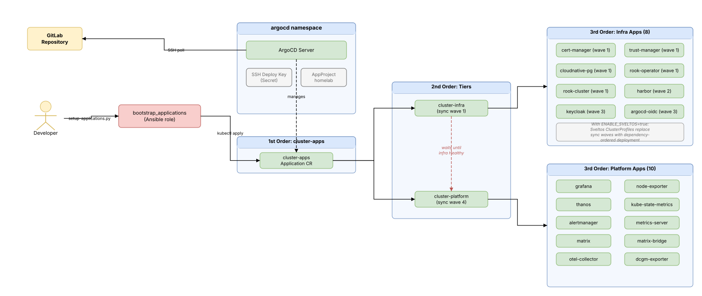

# ArgoCD GitOps

## What It Does

ArgoCD watches a Git repository and continuously reconciles the Kubernetes resources defined in it with what's actually running in the cluster. In this environment, it manages all application deployments — Prometheus, Grafana, Alertmanager, Matrix, Thanos, Rook-Ceph, and everything else in the `argocd_applications/` directory.



## Why It's Here

Without GitOps, deploying applications means running `kubectl apply` manually or through ad-hoc scripts. ArgoCD makes the Git repository the single source of truth:

- Push a manifest change to Git → ArgoCD detects it and syncs to the cluster
- Drift detection: if someone modifies a resource manually, ArgoCD can auto-heal it
- Audit trail: every change is a Git commit
- The `setup-applications.py` fast path only works because ArgoCD takes over lifecycle management after the initial manifest upload

## How It's Configured

### Installation

The `bootstrap_argocd` role installs ArgoCD from upstream manifests (version controlled by `ARGOCD_VERSION`), creates the `argocd` namespace, and sets up Ingress with TLS:

- **TLS termination**: cert-manager provisions a certificate for `argocd.k8s.local` via the `homelab-ca-issuer` ClusterIssuer
- **Insecure mode**: ArgoCD server runs with `server.insecure: "true"` (serves HTTP behind the TLS-terminating Cilium Ingress)
- **Access**: `https://argocd.k8s.local`

During initial bootstrap, cert-manager is not yet running (it deploys as an ArgoCD Application). ArgoCD is accessible via HTTP until cert-manager starts and provisions the TLS certificate.

An AppProject called `homelab` is created with permissive settings — all source repos, all destination namespaces, all resource types. This keeps the homelab simple; production would lock this down.

### SSH Key Management

The automation implements a fully idempotent system for Git repository authentication:

```
┌──────────────────────────────────────────────────────────────┐
│ 1. Check: does argocd-ssh-public-key ConfigMap exist?        │
└──────────────────┬───────────────────────────────────────────┘
                   │
          ┌────────┴─────────┐
          │                  │
     YES  │                  │  NO
          ▼                  ▼
┌──────────────────┐  ┌──────────────────────┐
│ Read existing    │  │ Generate 4096-bit    │
│ public key       │  │ RSA keypair          │
└────────┬─────────┘  └──────────┬───────────┘
         │                       │
         │            ┌──────────▼────────────┐
         │            │ Store public key in   │
         │            │ ConfigMap for reuse   │
         │            └──────────┬────────────┘
         └───────────────────────┘
                     │
         ┌───────────▼────────────────────────────────────┐
         │ 2. Parse REPOSITORY_SSH_URL                    │
         │    Extract host (gitlab.com) and path (user/repo) │
         │    URL-encode path: / → %2F for GitLab API     │
         └───────────┬────────────────────────────────────┘
                     │
         ┌───────────▼────────────────────────────────────┐
         │ 3. Register deploy key (GitLab only)           │
         │    GET existing keys → compare fingerprints    │
         │    POST new key only if not already registered │
         └───────────┬────────────────────────────────────┘
                     │
         ┌───────────▼────────────────────────────────────┐
         │ 4. Create argocd-repo-ssh-key Secret           │
         │    Labeled for ArgoCD auto-discovery           │
         └────────────────────────────────────────────────┘
```

**Why a ConfigMap for the public key?** Public keys aren't secrets — storing them in a ConfigMap lets the automation check on every run whether a key already exists without touching any sensitive data. The private key lives in a Kubernetes Secret with `no_log: true`.

**Key generation implementation**: Uses the `community.crypto.openssh_keypair` module with `force: false` (only generates if missing). Keys are temporarily written to `/tmp/argocd` (private) and `/tmp/argocd.pub` (public), then stored in Kubernetes resources and cleaned up.

**Task file separation**: The role's `main.yaml` orchestrates the flow and conditionally includes `manage_ssh_keys.yaml` (key generation + ConfigMap/Secret creation) only when the ConfigMap doesn't already exist.

**Why check existing keys?** GitLab's deploy key API doesn't deduplicate by content. Without checking existing keys before registration, every run would create a duplicate deploy key. The automation queries existing keys via the API and compares key content to avoid duplicates.

### Deploy Key Registration

The automation auto-detects the Git provider from the SSH URL:

- **GitLab**: Fully automated via `/api/v4/projects/{path}/deploy_keys`
  - Project path is URL-encoded (`/` → `%2F`) for the API
  - Key registered as read-only (cannot push)
  - Requires `REPOSITORY_TOKEN` with `api` scope
- **GitHub**: Prepared for future implementation

### Kubernetes Resources Created

| Resource | Namespace | Purpose |
|----------|-----------|---------|
| ConfigMap `argocd-ssh-public-key` | argocd | Stores public key for idempotent re-runs |
| Secret `argocd-repo-ssh-key` | argocd | Private key with `stringData` (type: git, url, sshPrivateKey), labeled `argocd.argoproj.io/secret-type: repository` for ArgoCD auto-discovery |
| AppProject `homelab` | argocd | Permissive project for all applications |

## Application Deployment Flow

Applications are deployed through a **three-tier app-of-app-of-apps** pattern that gives ArgoCD full control over deployment ordering. When `ENABLE_SVELTOS=true`, this pattern is replaced by Sveltos ClusterProfiles — see [Sveltos Orchestration Alternative](#sveltos-orchestration-alternative) below.

### How It Works

1. The `bootstrap_applications` role applies a single parent manifest (`cluster-apps_manifest.yaml`) to the cluster
2. This creates the **first-order** Application (`cluster-apps`) which reads `argocd_applications/cluster-apps/` with `directory.recurse: false`
3. ArgoCD discovers two **second-order** Applications inside that directory: `cluster-infra` (sync wave 1) and `cluster-platform` (sync wave 4)
4. Each second-order Application points to a subdirectory containing **third-order** Application manifests — the actual apps
5. Sync waves at the second order ensure all infra apps are Healthy before any platform apps begin deploying
6. Within the infra tier, sync waves on individual apps enforce fine-grained ordering (cert-manager before Harbor before Keycloak)

**Implementation detail**: The role uses `kubernetes.core.k8s` with `definition: "{{ lookup('file', item) }}"` and iterates via `loop: "{{ lookup('fileglob', role_path + '/files/*_manifest.yaml', wantlist=True) }}"`. Currently there is only one manifest (`cluster-apps_manifest.yaml`), but the glob pattern keeps the role extensible.

### Application Health Check

For sync waves to block on child Applications becoming Healthy, ArgoCD must have an Application health check enabled. This was removed as a default in ArgoCD 1.8. The `bootstrap_argocd` role re-enables it by patching `argocd-cm` with a Lua health check script:

```lua
resource.customizations.health.argoproj.io_Application: |
  hs = {}
  hs.status = "Progressing"
  hs.message = ""
  if obj.status ~= nil then
    if obj.status.health ~= nil then
      hs.status = obj.status.health.status
      if obj.status.health.message ~= nil then
        hs.message = obj.status.health.message
      end
    end
    if obj.status.operationState == nil then
      hs.status = "Progressing"
      hs.message = "Waiting for first sync"
    elseif obj.status.operationState.phase == "Running" then
      hs.status = "Progressing"
      hs.message = "Sync operation running"
    end
  end
  return hs
```

The script defaults to "Progressing" (blocking the next wave) and only passes through the Application's reported health once at least one sync operation has completed. This prevents a freshly-created Application (which has no managed resources and therefore appears "Healthy") from allowing ArgoCD to advance to the next sync wave before child apps have been deployed.

### Application Manifest Structure

Applications are organized into two tiers based on which node role they target. Infra-tier apps run on nodes tainted `role=infra:NoSchedule`, platform-tier apps on nodes tainted `role=platform:NoSchedule`. Every pod spec must include a toleration matching its tier.

```
argocd_applications/
├── cluster-apps/                          ← App-of-app-of-apps hierarchy
│   ├── infra.yaml                         ← 2nd order: sync wave 1 (cluster-infra)
│   ├── infra/                             ← 3rd order: infra apps (tolerate role=infra)
│   │   ├── cert-manager.yaml              (wave 1)
│   │   ├── trust-manager.yaml             (wave 1)
│   │   ├── cloudnative-pg.yaml            (wave 1)
│   │   ├── rook-ceph-operator.yaml        (wave 1, conditional: ENABLE_ROOK)
│   │   ├── rook-ceph-cluster.yaml         (wave 1, conditional: ENABLE_ROOK)
│   │   ├── dragonfly.yaml                 (wave 2, conditional: ENABLE_DRAGONFLY)
│   │   ├── harbor.yaml                    (wave 2)
│   │   ├── keycloak.yaml                  (wave 3)
│   │   └── argocd-oidc.yaml               (wave 3)
│   ├── platform.yaml                      ← 2nd order: sync wave 4 (cluster-platform)
│   └── platform/                          ← 3rd order: platform apps (tolerate role=platform, no waves)
│       ├── alertmanager.yaml
│       ├── dcgm-exporter.yaml
│       ├── grafana.yaml
│       ├── jaeger.yaml
│       ├── kube-state-metrics.yaml
│       ├── loki.yaml
│       ├── matrix.yaml
│       ├── matrix-bridge.yaml
│       ├── metrics-server.yaml
│       ├── node-exporter.yaml
│       ├── otel-collector.yaml
│       └── thanos.yaml
├── monitoring/                            ← Kustomize manifests (actual resources)
│   ├── prometheus/
│   ├── grafana/
│   ├── alertmanager/
│   ├── thanos/
│   └── ...
├── storage/
│   ├── cloudnative-pg/
│   ├── rook-operator/
│   └── rook-cluster/
├── security/
│   ├── cert-manager/
│   ├── trust-manager/
│   ├── keycloak/
│   └── argocd-oidc/
└── infrastructure/
    ├── dragonfly/
    └── harbor/

roles/bootstrap_applications/files/
└── cluster-apps_manifest.yaml             ← Single parent Application CR
```

### Deployment Ordering

The three-tier structure enforces dependencies through sync waves at two levels:

**Second-order** (between tiers):

| Wave | Application | Purpose |
|------|-------------|---------|
| 1 | `cluster-infra` | Infrastructure dependencies must all be Healthy first |
| 4 | `cluster-platform` | Monitoring and application stack, deploys only after infra is ready |

**Third-order** (within infra tier):

| Wave | Applications | Why This Order |
|------|-------------|----------------|
| 1 | cert-manager, trust-manager, CloudNativePG, rook-ceph-operator, rook-ceph-cluster | Infrastructure CRDs + operators must exist before dependents |
| 2 | Harbor | Registry + proxy cache — must be operational before apps pulling from `harbor.k8s.local` |
| 3 | Keycloak, ArgoCD OIDC | Identity provider after Harbor (image pulled from cache). OIDC patches `argocd-cm` + `argocd-rbac-cm` |

Platform-tier apps have no internal ordering — they deploy simultaneously once the entire infra tier is Healthy.

### ignoreDifferences and RespectIgnoreDifferences

Parent Applications (first-order and second-order) include `ignoreDifferences` for child Application CRDs to prevent the parent from going OutOfSync when ArgoCD mutates child resources during sync operations:

```yaml
ignoreDifferences:
  - group: "*"
    kind: "Application"
    jsonPointers:
      - /spec/syncPolicy/automated    # ArgoCD removes this during sync
      - /metadata/annotations/argocd.argoproj.io~1refresh  # Transient refresh annotation
      - /operation                     # In-progress sync operation field
```

The `RespectIgnoreDifferences=true` syncOption ensures the diffing engine honors these exclusions.

## Sveltos Orchestration Alternative

When `ENABLE_SVELTOS=true`, the app-of-apps pattern described above is replaced by [Project Sveltos](https://projectsveltos.github.io/sveltos/) ClusterProfiles. ArgoCD remains the deployment engine — Sveltos only controls the ordering of Application CR creation.

### How It Works

1. The `bootstrap_sveltos` role installs Sveltos via Helm into the `projectsveltos` namespace
2. Each Application CR from `cluster-apps/infra/` and `cluster-apps/platform/` is packaged into a ConfigMap in the `projectsveltos` namespace
3. ClusterProfile manifests (one per app, stored in `sveltos_profiles/`) reference these ConfigMaps via `policyRefs` with `deploymentType: Remote`
4. `dependsOn` fields encode the dependency graph — Sveltos only creates an Application CR once all its dependencies report Healthy
5. `validateHealths` Lua scripts check Deployments, StatefulSets, or CephCluster status before unblocking dependents
6. ArgoCD picks up the Application CRs and syncs workloads from Git as before

### What Gets Disabled

When Sveltos is enabled, the following legacy mechanisms are skipped:

| Component | Condition | Why |
|-----------|-----------|-----|
| Lua health-check hack in `argocd-cm` | `ENABLE_SVELTOS != 'true'` | Sveltos `validateHealths` replaces sync-wave blocking |
| `bootstrap_applications` role | `ENABLE_SVELTOS != 'true'` | No app-of-apps parent CR needed |
| `bootstrap_rook_ceph` role | `ENABLE_SVELTOS != 'true'` | Rook ordering handled by Sveltos `dependsOn` chain |

The sync-wave annotations on Application CRs are preserved (harmless when Sveltos is active) so the `ENABLE_SVELTOS=false` fallback works without modification.

### Dependency Graph

All apps that pull images from the Harbor proxy cache include `harbor` in their `dependsOn` list. The graph below shows full dependency edges:

```
cert-manager ──► trust-manager ──► harbor ◄── rook-ceph-cluster ◄── rook-ceph-operator
                                      │
                                      ├◄─ node-exporter
                                      ├◄─ dcgm-exporter
                                      ├◄─ kube-state-metrics
                                      ├◄─ metrics-server
                                      ├◄─ otel-collector
                                      ├◄─ loki
                                      │
cloudnative-pg ──► keycloak ──► argocd-oidc
                       │
                       ├──► grafana ◄── thanos ◄── otel-collector
                       │                  │
                       └──► matrix        ├──► alertmanager
                              │           │
                              └───────────┴──► matrix-bridge
```

Every app except `cert-manager`, `trust-manager`, `rook-ceph-operator`, `rook-ceph-cluster`, and `argocd-oidc` depends on `harbor` (directly or transitively). Apps like `node-exporter`, `dcgm-exporter`, `kube-state-metrics`, `metrics-server`, `otel-collector`, and `loki` depend _only_ on `harbor`.

For Sveltos configuration variables, see [Configuration — Sveltos](../infrastructure/configuration.md#sveltos-orchestration-layer).

## Configuration

See [Configuration](../infrastructure/configuration.md#argocd-gitops) for environment variables and setup steps.

## Troubleshooting

```bash
# Check ArgoCD pods
kubectl get pods -n argocd
kubectl logs -n argocd -l app.kubernetes.io/name=argocd-server --tail=30

# Check application sync status
kubectl get applications -n argocd
kubectl describe application <app-name> -n argocd | tail -30

# Check SSH key registration
kubectl get configmap argocd-ssh-public-key -n argocd
kubectl get secret argocd-repo-ssh-key -n argocd
```

**Repo-server CrashLoopBackOff (copyutil symlink)**:
- Upstream bug [#26595](https://github.com/argoproj/argo-cd/issues/26595): the `copyutil` init container uses `ln -s` without `-f`, so any container restart within the same pod fails with `File exists`
- Fixed in v3.4.0 ([PR #26613](https://github.com/argoproj/argo-cd/pull/26613)), not backported to 3.3.x
- Workaround applied in `roles/bootstrap_argocd/tasks/main.yaml` — patches the init container args to use `ln -sf`
- **TODO: Remove the workaround patch after upgrading to ArgoCD >= v3.4.0**
- Immediate recovery: `kubectl delete pod -n argocd -l app.kubernetes.io/name=argocd-repo-server`

**Application out of sync**:
- Check ArgoCD UI at `https://argocd.k8s.local`
- Force sync from the UI, or delete the application and re-run `setup-applications.py`
- Check for manifest errors in the application events tab

**SSH deploy key not registered**:
- Check ConfigMap exists: `kubectl get configmap argocd-ssh-public-key -n argocd`
- Delete ConfigMap to force regeneration: `kubectl delete configmap argocd-ssh-public-key -n argocd`
- Re-run `setup-clusters.py` to regenerate and re-register

**Repository not accessible**:
- Verify `REPOSITORY_SSH_URL` format: `git@gitlab.com:user/repo.git`
- Check `REPOSITORY_TOKEN` has `api` scope (needed for deploy key registration)
- Test SSH: `ssh -i /tmp/argocd git@gitlab.com` (should show "Welcome to GitLab")

## Links

- [ArgoCD Documentation](https://argo-cd.readthedocs.io/en/stable/)
- [ArgoCD Application CRD](https://argo-cd.readthedocs.io/en/stable/operator-manual/declarative-setup/)
- [ArgoCD Sync Waves](https://argo-cd.readthedocs.io/en/stable/user-guide/sync-waves/)
- [GitLab Deploy Keys API](https://docs.gitlab.com/ee/api/deploy_keys.html)
- [Project Sveltos Documentation](https://projectsveltos.github.io/sveltos/)
- [Sveltos ClusterProfile Reference](https://projectsveltos.github.io/sveltos/addons/addons/)
- [GitLab Deploy Keys API](https://docs.gitlab.com/ee/api/deploy_keys.html)
