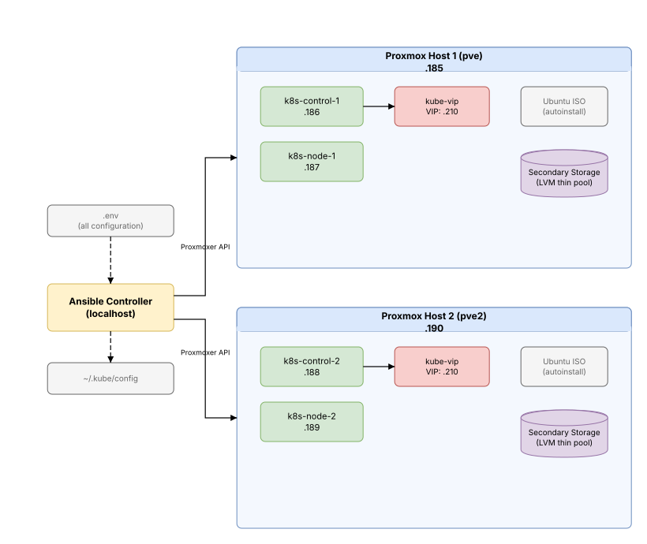

# Architecture

## What This Document Covers

A high-level map of how the project is structured — the entry points, the Ansible roles, and how they connect. If you want to understand what runs where and in what order, start here. For the detailed per-phase breakdown, see [Ansible Pipeline](../cicd/ansible-pipeline.md).



## Two Execution Paths

The project has two independent entry points with very different risk profiles:

### Full Provisioning (`setup-clusters.py`)

Runs `setup_cluster.yaml` — the 16-play playbook that builds everything from bare metal to a running cluster with applications.

- **Duration**: ~26 minutes
- **What it touches**: Proxmox VMs, OS configuration, Kubernetes cluster, networking, storage, GitOps, applications
- **When to use**: New deployments, adding nodes, infrastructure changes, major version upgrades
- **Risk**: Destructive — creates and configures VMs from scratch

### Application Deployment (`setup-applications.py`)

Runs `setup_applications.yaml` — two plays that upload ArgoCD Application manifests and optionally deploy Sveltos profiles.

- **Duration**: Seconds
- **What it touches**: ArgoCD Application CRs only (plus Sveltos ClusterProfiles when `ENABLE_SVELTOS=true`)
- **When to use**: Adding applications, modifying manifests, day-to-day development
- **Risk**: Non-destructive — never touches infrastructure or cluster state

This separation exists so you can iterate on application configs without risking a 26-minute rebuild. There's also `cleanup-clusters.py` which reverses everything (destroys VMs, wipes storage, removes kubeconfig), and `expose-ca.py` which re-displays the root CA trust setup instructions for importing the homelab CA certificate into your browser.

## Role Map

The automation is organized into Ansible roles, each responsible for one concern. They execute in a specific order defined by the playbook.

### Infrastructure Layer

| Role | Runs On | Purpose |
|------|---------|---------|
| `test_ansible_runner` | localhost | Smoke test — confirms Ansible Runner is functional |
| `setup_localhost` | localhost | Installs CLI tools, remasters Ubuntu ISO, discovers secondary storage, provisions LVM thin pools |
| `provision_infra` | proxmox | Creates VMs from autoinstall ISO, configures users, applies static networking |
| `install_repo` | (included) | Utility role for adding APT repositories (used by setup_localhost, setup_os) |

**CLI tools installed by `setup_localhost`**:

| Tool | Version Strategy |
|------|-----------------|
| kubectl | Pinned to `K8S_VERSION` via APT |
| Helm | Latest from Helm APT repo |
| Cilium CLI | Always fetches latest stable from GitHub |
| Hubble CLI | Always fetches latest stable from GitHub |
| istioctl | Pinned to `ISTIO_VERSION` (only when `ENABLE_ISTIO=true`) |

> Cilium CLI and Hubble CLI are **not version-pinned** — they always pull the latest stable release. This is usually fine since they're client tools, but be aware if you need reproducible environments.

**What `provision_infra` actually does**: Downloads the Ubuntu Server ISO, remasters it with a cloud-init `autoinstall.yaml` embedded in the image, injects a custom GRUB menu entry (into both `grub.cfg` and `loopback.cfg` with a 1-second timeout for fast automated boot), recalculates MD5 checksums, and creates a hybrid BIOS+UEFI ISO using 7z (extraction) + xorriso (rebuild with GPT partition GUIDs from the `[BOOT]` directory). The ISO is checked against all configured Proxmox hosts, built once locally if any host is missing it, then uploaded to each host that needs it. VM creation uses `create_vm.py` which checks for duplicate VMs by name — if a VM with the same name already exists, the script exits successfully without creating anything (making re-runs safe). Each host in inventory has a `proxmox_cluster` field that maps to the correct Proxmox API connection in the `proxmox_cluster` dict. The script enables QEMU Guest Agent, sets balloon memory to 0, uses `virtio-scsi-single` SCSI controller, and boots with `order=scsi0;ide2`. After boot, the playbook polls for a DHCP-assigned IP (20-minute timeout). If the poll fails (autoinstall stuck or no DHCP lease), a rescue block invokes `reinstall_vm.py` which sets boot order to ISO first and `reboot=0` (so the VM halts on guest reboot instead of rebooting), stops and restarts the VM to re-run the autoinstall, waits for the VM to halt when the installer finishes, then reverts boot order to disk first and re-enables reboot while the VM is stopped (so config changes apply immediately rather than going into Proxmox's pending state), and starts the VM from disk — followed by a second 20-minute IP poll. After the IP is obtained, it configures hostname, creates the SSH user with passwordless sudo, deploys authorized keys, applies a static IP via a netplan template, kills the default `ubuntu` user sessions and processes, removes it, and disables password authentication in sshd. VMs are staggered during creation with cluster-interleaved delays (alternating between Proxmox hosts so same-cluster VMs are well-separated) and the script retries with exponential backoff on VMID collision to handle race conditions under `strategy: free`.

### Kubernetes Layer

| Role | Runs On | Purpose |
|------|---------|---------|
| `setup_os` | k8s nodes | Disables swap, installs CRI-O + kubeadm, configures firewall |
| `setup_cluster_master` | k8s-control | Optionally deploys kube-vip static pod for API server HA (with per-node kubeconfig selection), runs kubeadm init on the primary control plane with `--control-plane-endpoint`, `--upload-certs`, `--ignore-preflight-errors=NumCPU`, joins secondary control planes, fetches kubeconfig to localhost, applies node labels and taints |
| `setup_cluster_node` | k8s-nodes | Joins workers to cluster with `--ignore-preflight-errors=NumCPU`, applies and enforces declarative node labels and taints |

**Kubeconfig handling**: `kubeadm init` generates `/etc/kubernetes/admin.conf` on the primary control plane. The role fetches this file to localhost as `new_cluster_admin.conf`, then copies it to `~/.kube/config` (controlled by the `OVERWRITE_KUBECONFIG` variable, which defaults to `true`). Other roles reference the kubeconfig at its localhost path (`/etc/kubernetes/new_cluster_admin.conf`) for Kubernetes API operations.

**Multi-control-plane support**: When `K8S_VIP` is set and the cluster is new, kube-vip is deployed as a static pod on each control plane node before `kubeadm init`. The primary control plane (`k8s-control-1`) initializes with `--control-plane-endpoint=<VIP>:6443 --upload-certs`. Secondary control planes join using `kubeadm join --control-plane` with the certificate key from the primary. The kube-vip deployment is guarded by a stat check on the primary's `admin.conf` — if the cluster already exists, kube-vip is skipped on all nodes.

**kube-vip kubeconfig selection**: Since Kubernetes 1.29+, `admin.conf` uses a non-privileged user that requires a ClusterRoleBinding (created during `kubeadm init`). On the primary control plane, kube-vip must start *before* `kubeadm init` creates this binding, so it mounts `super-admin.conf` instead — this file has `system:masters` baked into the client certificate and works without RBAC. Secondary control planes use `admin.conf` because the ClusterRoleBinding already exists by the time they join. The template uses a Jinja2 conditional on `inventory_hostname` to select the correct hostPath. An explicit `vip_kubeconfig` environment variable tells kube-vip where to find the mounted kubeconfig (static pods don't have service accounts, so the default in-cluster auth doesn't work).

**Declarative node labels and taints**: Both master and worker roles apply labels and taints from inventory definitions, removing any that are no longer declared — enforcing desired state on every run. Labels protected from removal differ by role:
- **Control plane**: `kubernetes.io/*` and `k8s.io/*` namespaces are protected
- **Workers**: `kubernetes.io/*`, `k8s.io/*`, `nvidia.com/*`, `accelerator`, and `gpu-type` are all protected (GPU labels are managed by the device plugin, not inventory)

Labels are only updated when a key is missing or its value differs from what's in inventory.

**Taint management**: Worker nodes carry `NoSchedule` taints matching their role (`role=infra:NoSchedule` or `role=platform:NoSchedule`). The automation reads desired taints from the `taints` list in inventory, compares them against current taints on the node (excluding system-managed taints from `kubernetes.io`, `k8s.io`, and `nvidia.com` namespaces), removes stale user-managed taints, and applies desired taints with `--overwrite`. This ensures pods only schedule on nodes whose role they explicitly tolerate.

### PKI Layer

| Role | Runs On | Purpose |
|------|---------|---------|
| `setup_pki` | k8s-control | Generates Root CA (ECC secp384r1, 10-year) and Intermediate CA (5-year, pathlen:0), fetches certs to controller |
| `distribute_pki` | k8s (all) | Installs root CA in system trust store, configures CRI-O registry mirrors for Dragonfly P2P (fallback: direct upstream) |
| `bootstrap_pki_secret` | localhost | Pre-creates the `homelab-ca-secret` Secret in `cert-manager` namespace (intermediate cert+key, root CA). Conditionally creates `dragonfly-ca-cert` Secret in `dragonfly-system` namespace (`ENABLE_DRAGONFLY`) |
| `bootstrap_harbor_secret` | localhost | Pre-creates the `harbor-admin-password` Secret with a random 32-char password (idempotent) |

**PKI chain**: Root CA → Intermediate CA → cert-manager leaf certificates. The root CA private key never leaves the control plane node. Only the certificates and the intermediate key are fetched to the Ansible controller for distribution. CRI-O mirrors route image pulls through Dragonfly P2P (`127.0.0.1:4001`) which pulls from Harbor's proxy cache (`harbor.k8s.local/{registry}-cache`), falling back to upstream registries when Dragonfly is unavailable.

### Networking Layer

| Role | Runs On | Purpose |
|------|---------|---------|
| `bootstrap_cillium` | k8s (all) | Deploys Cilium CNI with eBPF, WireGuard, L2 announcements, CoreDNS rewrite |
| `bootstrap_istio_ambient` | k8s-control | Deploys Istio Ambient mesh with ztunnel (optional) |
**Post-install actions**: After Cilium is deployed, the role restarts CRI-O on each node for proper CNI integration, then finds and deletes all non-hostNetwork pods across all namespaces so they restart with Cilium networking applied. For Istio, there's a 10-second pause after CRD installation, then each component waits for rollout (300s timeout) before proceeding.
### Platform Layer

| Role | Runs On | Purpose |
|------|---------|---------|
| `bootstrap_argocd` | localhost | Installs ArgoCD, manages SSH deploy keys, creates AppProject |
| `bootstrap_sveltos` | localhost | Installs Sveltos orchestration layer, creates ConfigMaps from Application CRs, applies ClusterProfiles (optional) |
| `bootstrap_nvidia_device_plugin` | localhost | Creates RuntimeClass, deploys GPU device plugin (optional) |
| `bootstrap_cephfs_storage_class` | localhost | Deploys CephFS CSI driver for external Ceph (optional) |
| `bootstrap_rook_ceph` | localhost | Deploys Rook-Ceph operator and cluster via ArgoCD (optional) |
| `bootstrap_applications` | localhost | Uploads the app-of-apps parent manifest (ArgoCD cascades to all apps) |
| `cleanup_cluster` | localhost | Iterates over each Proxmox cluster: destroys VMs, removes storage pools, wipes disks |

### How `setup_os` Fits In

The `setup_os` role is never called directly from the playbook. Instead, both `setup_cluster_master` and `setup_cluster_node` include it at the start of their execution. This means OS preparation runs on every cluster node, but always as part of the master or worker setup flow.

The role also has two optional sub-task files that run conditionally:
- `configure_ceph_kernel.yaml` — loads the Ceph kernel module (when `ENABLE_CEPH=true`)
- `configure_cuda.yaml` — installs NVIDIA drivers and Container Toolkit (when node has `compute: cuda` label)

## Execution Order

The main playbook runs these 16 plays in sequence. Each play targets a specific host group:

```
 1. localhost        →  test_ansible_runner + setup_localhost
 2. proxmox          →  provision_infra
 3. k8s-control      →  setup_cluster_master (includes setup_os)
 4. k8s-nodes        →  setup_cluster_node (includes setup_os)
 5. k8s-control      →  setup_pki
 6. k8s (all nodes)  →  distribute_pki
 7. k8s (all nodes)  →  bootstrap_cillium
 8. k8s-control      →  bootstrap_istio_ambient
 9. localhost         →  bootstrap_nvidia_device_plugin
10. localhost         →  bootstrap_argocd
11. localhost         →  bootstrap_sveltos
12. localhost         →  bootstrap_pki_secret
13. localhost         →  bootstrap_harbor_secret
14. localhost         →  bootstrap_cephfs_storage_class / bootstrap_rook_ceph
15. localhost         →  bootstrap_applications
16. localhost         →  display root CA trust instructions
```

Optional roles (Istio, CUDA, CephFS, Rook, Sveltos) are gated by environment variables and skip cleanly when disabled.

## Inventory Structure

Two inventory files target different host groups:

**`inventory/k8s.yaml`** — defines cluster nodes:
- Host groups: `proxmox`, `k8s-control`, `k8s-nodes` (all inherit from parent group `k8s`)
- Every variable comes from `.env` via `{{ lookup("env", "VAR_NAME") }}`
- Per-host `proxmox_cluster` field (e.g., `cluster_1`, `cluster_2`) maps each VM to its Proxmox host
- Per-host node labels (e.g., `role: infra`, `role: platform`, `compute: cuda` for GPU workers)
- Per-host taints (e.g., `role=infra:NoSchedule`, `role=platform:NoSchedule`)
- Group-level vars include `k8s_vip` and `kube_vip_version` for API server HA
- **Label and taint aggregation**: Since Ansible's default `hash_behaviour=replace` doesn't merge dictionaries, the `provision_infra` role includes `aggregate_labels.yaml` which reads the raw inventory YAML and merges labels from all group levels. A host can inherit `infra: proxmox` from its group and `compute: cuda` from its host-level definition. Taints are aggregated from the `taints` list in inventory (e.g., `[{key: role, value: infra, effect: NoSchedule}]`).
- **`bare-metal` group**: Exists as an empty placeholder (`hosts: {}`) with `labels.infra: baremetal` for future bare-metal node support

**`inventory/localhost.yaml`** — defines the control machine:
- Used for all Kubernetes API operations (ArgoCD, storage, GPU plugin)
- Points to the venv Python interpreter: `{{ playbook_dir }}/.venv/bin/python`
- Contains a `proxmox_cluster` dict map with entries for each Proxmox host (API host, user, password, node name, storage names)
- Contains Ceph, GPU, and ArgoCD credentials
- Note: `ENABLE_ROOK` is **not** in the inventory — it's read directly from the environment via `lookup('env', 'ENABLE_ROOK')` in the playbook, unlike other feature flags

## Key Design Decisions

**Everything from `.env`**: No defaults live in roles. Every configurable value comes from environment variables, loaded by `python-dotenv` in the entry scripts. This means a missing variable fails fast rather than silently using a wrong default.

**Delegation pattern**: Kubernetes API operations (creating resources, Helm installs) always run on `localhost` using `delegate_to: localhost` with the fetched kubeconfig. The cluster nodes never need kubectl installed.

**Idempotency everywhere**: Every role is safe to re-run. ConfigMaps are checked before key generation, `kubeadm init` uses `creates:` guards, labels are diffed before applying, and APT packages use `state: present`.

**Network resilience**: All network-dependent operations (apt installs, GPG key downloads, Helm repo adds, Helm chart installs, manifest downloads from GitHub) are protected with `retries: 5` and `delay: 10-15s`. The Ubuntu autoinstall ISO uses `early-commands` to stabilize the network before subiquity probes devices (NIC bring-up, DHCP lease, DNS verification) and writes apt retry settings to the live installer environment so curtin's package installs also retry. The target system receives its own `Acquire::Retries` config via the `apt` section and `late-commands`. See [Troubleshooting — Intermittent network failures](troubleshooting.md#common-root-causes) for details.

**Label-driven behavior**: GPU passthrough, CUDA drivers, and device plugin targeting all key off the `compute: cuda` label in inventory. Add the label to a node and the entire GPU stack activates for it. Similarly, the `role: infra` and `role: platform` labels (along with their matching taints) drive workload isolation — infra-tier apps (ArgoCD, Harbor, cert-manager, Rook-Ceph, Keycloak, CloudNativePG) schedule on infra nodes, while platform-tier apps (Prometheus, Grafana, Thanos, Matrix, Alertmanager, etc.) schedule on platform nodes. Secondary disk attachment for Rook-Ceph OSDs is also restricted to infra-role nodes.

## Troubleshooting

```bash
# Verify .env variables are set (catches missing values before a run)
grep -E '^[A-Z]' .env | head -20
python3 -c "from dotenv import dotenv_values; v=dotenv_values('.env'); [print(f'EMPTY: {k}') for k,v in v.items() if not v]"

# Verify role file structure
find roles/ -name main.yaml -type f | sort

# Check last run artifacts (start here after a failure)
ls -la artifacts/*/
cat artifacts/*/stdout | tail -100
cat artifacts/*/stderr
```

**Role not executing**: Check the `when:` condition on the play in `setup_cluster.yaml`. Optional roles (Istio, CUDA, CephFS, Rook) are gated by environment variable checks — ensure the corresponding `ENABLE_*` variable is set to `true` in `.env`.

**Wrong execution order**: Roles run in the order listed in the playbook, not alphabetically. If a role depends on another, check `setup_cluster.yaml` to verify the play ordering.

**"Variable undefined" errors**: Every variable comes from `.env` via `lookup("env", "VAR_NAME")`. If a variable is missing, Ansible fails at template time. Cross-check with `example.env` for the complete list.

---

## File Organization

| Directory | Contents |
|-----------|----------|
| `roles/*/tasks/` | Ansible task files — `main.yaml` orchestrates, sub-tasks included conditionally |
| `roles/*/templates/` | Jinja2 templates (e.g., `netplan.j2` for static IP configuration) |
| `roles/*/files/` | Static files — Python scripts (`create_vm.py`, `discover_storage.py`), ArgoCD manifests |
| `argocd_applications/{category}/{app}/` | Kustomize manifests organized by category (monitoring, storage, security, infrastructure) |
| `argocd_applications/cluster-apps/` | App-of-app-of-apps hierarchy — parent, infra tier, and platform tier Application manifests |
| `roles/bootstrap_applications/files/` | ArgoCD app-of-apps parent manifest (`cluster-apps_manifest.yaml`) |
| `sveltos_profiles/` | Sveltos ClusterProfile manifests (18 profiles, one per ArgoCD Application) |
| `inventory/` | `k8s.yaml` (cluster nodes) + `localhost.yaml` (control machine) |
| `env/envvars` | Ansible Runner environment variables (auto-generated) |
| `artifacts/` | Ansible Runner output — cleaned and repopulated on each run |
| `library/` | Custom Ansible modules (if any) |

## Related Documents

- [Ansible Pipeline](../cicd/ansible-pipeline.md) — detailed per-phase breakdown of what each role does
- [Configuration](configuration.md) — environment variable reference for optional features
- [GitOps](../cicd/gitops.md) — ArgoCD SSH key management architecture
