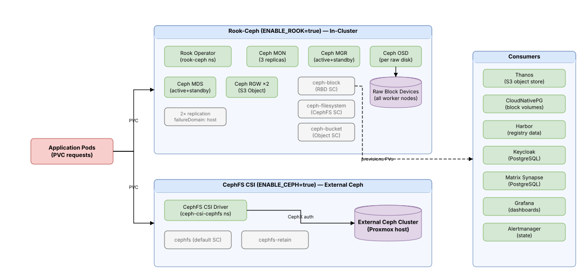

# Storage

## What This Document Covers

The two persistent storage options available for the cluster. Both are optional, both can coexist, and they serve different use cases. Choose based on whether you have external Ceph infrastructure or want storage to run inside Kubernetes.



## At a Glance

| | CephFS CSI | Rook-Ceph |
|---|-----------|-----------|
| **Feature flag** | `ENABLE_CEPH=true` | `ENABLE_ROOK=true` |
| **Ceph runs** | Outside the cluster (external) | Inside the cluster (in-cluster) |
| **Requires** | Existing Ceph infrastructure | Raw block devices on Proxmox host |
| **Storage types** | CephFS (filesystem only) | Block (RBD), Filesystem (CephFS), Object (S3) |
| **Management** | Manual Ceph administration | GitOps via ArgoCD |
| **Resource impact** | Minimal (just CSI driver pods) | Significant (MON, MGR, OSD, MDS, RGW pods on workers) |
| **Best for** | Already have Proxmox Ceph | Self-contained homelab, no external dependencies |

---

## CephFS CSI Driver (`ENABLE_CEPH=true`)

### What It Does

Connects the cluster to an external Ceph cluster using the kernel CephFS mount. The CSI driver handles dynamic provisioning — when a pod requests a PersistentVolumeClaim, the driver creates a CephFS subvolume and mounts it into the pod automatically.

### Why You'd Use It

If your Proxmox host already runs Ceph (common in Proxmox clusters), this is the simplest path to persistent storage. You don't need extra disks or in-cluster Ceph daemons — just point the CSI driver at your existing monitors.

### How It's Configured

**Deployment**: Ceph CSI CephFS Helm chart in the `ceph-csi-cephfs` namespace.

**Tolerations**: The provisioner (Deployment) tolerates `role=infra:NoSchedule` to schedule on infra nodes. The nodeplugin (DaemonSet) tolerates all `role` taints with `operator: Exists` since it must run on every worker node to mount CephFS volumes into pods.

**Helm `cephconf`**: Injects monitor host and authentication requirements into `ceph.conf` on each node:
- `mon_host = <CEPH_MONITOR>`
- `auth_cluster_required = cephx`, `auth_service_required = cephx`, `auth_client_required = cephx`
- `fuse_big_writes = true` (improves write performance)

**Credentials**: Stored in a Kubernetes Secret with careful encoding:
- `userID` and `adminID`: Plain text encoded with Ansible's `b64encode` filter
- `userKey` and `adminKey`: Passed through as-is (Ceph keys are already base64)

**Provisioner replicas**: Scaled dynamically based on worker node count — 1 replica for single-node clusters, 2+ for multi-node.

**Mount method**: Uses kernel CephFS mount (not FUSE) for better performance.

**StorageClasses created**:

| StorageClass | Reclaim Policy | Mount Options | Use Case |
|-------------|---------------|---------------|----------|
| `cephfs` (default) | Delete | `recover_session=clean` | General workloads — PV deleted when PVC is removed |
| `cephfs-retain` | Retain | `recover_session=clean`, `cache_size=33554432` | Important data — PV preserved after PVC deletion |

### CSI Version Compatibility

| Version | Ceph Client Permissions Needed |
|---------|-------------------------------|
| v3.9.0 and earlier | `cephfs_data` + `cephfs_metadata` pools |
| v3.12.0 through v3.15.0 | Above + `.mgr` pool (volumes manager API) |

If you upgrade to v3.12+ and see `"rados: ret=-1, Operation not permitted"`, update the Ceph client permissions:

```bash
ceph auth caps client.kubernetes \
  mon 'allow r' \
  mds 'allow rw fsname=cephfs' \
  osd 'allow rw pool=cephfs_data, allow rw pool=cephfs_metadata, allow rw pool=.mgr' \
  mgr 'allow rw'
```

### Prerequisites

- External Ceph cluster with CephFS filesystem created
- Ceph kernel module loaded on all nodes (handled by `setup_os` role)
- Client credentials gathered (see [Configuration](configuration.md#cephfs-storage-external-ceph))

---

## Rook-Ceph (`ENABLE_ROOK=true`)

### What It Does

Rook is a Kubernetes operator that runs a full Ceph cluster inside your Kubernetes cluster. It discovers raw block devices attached to worker VMs, creates OSDs from them, and provides block, filesystem, and S3-compatible object storage — all managed through Kubernetes CRDs and GitOps.

### Why You'd Use It

If you don't have external Ceph infrastructure and want a fully self-contained storage solution:

- No external dependencies — everything runs inside Kubernetes
- GitOps-managed via ArgoCD (operator + cluster config are Application manifests)
- Provides all three Ceph storage types: block, filesystem, and S3
- Lifecycle tied to the cluster — deploy, upgrade, and tear down together

### How It's Configured

**Two-phase deployment** via ArgoCD sync waves:

1. **Operator (wave 1)**: CRDs, RBAC, and the Rook operator Deployment from upstream v1.19.1 manifests
2. **Cluster (wave 2)**: CephCluster CR, storage pools, and StorageClasses

**Ceph version**: v19.2.3 (Squid stable release)

**Operator configuration patches** (`operator-config-patch.yaml`):

| Setting | Value | Purpose |
|---------|-------|----------|
| `CSI_PROVISIONER_REPLICAS` | `"1"` | Single-replica CSI for small clusters |
| `ROOK_ENABLE_DISCOVERY_DAEMON` | `"true"` | Auto-detects raw block devices on worker nodes |
| `CSI_ENABLE_CEPHFS_SNAPSHOTTER` | `"true"` | Enables CephFS volume snapshots |
| `CSI_ENABLE_RBD_SNAPSHOTTER` | `"true"` | Enables RBD (block) volume snapshots |
| `ROOK_CSI_ENABLE_HOST_NETWORK` | `"false"` | Disables host networking for test clusters |

Operator sync policy: `prune: false` (never auto-delete operator), `selfHeal: true`.

**Single-node optimization**: This setup is designed for a homelab, not production:
- MON count 3 with `allowMultiplePerNode: true` (quorum across 2 workers)
- MGR count 2 (active + standby)
- Replication size = 2 with `failureDomain: host` (replicas on different workers)
- `osd_pool_default_min_size = 1` allows degraded I/O during single-node outages

**CephCluster configuration** (`cluster.yaml`):

| Component | Config | Notes |
|-----------|--------|--------|
| **Monitor (MON)** | 3 instances, `allowMultiplePerNode: true`, `system-node-critical` priority | Maintains cluster map; quorum requires majority |
| **Manager (MGR)** | 2 instances (active + standby), `pg_autoscaler` enabled | Automatic placement group tuning |
| **Dashboard** | HTTP (no SSL), port 8443 | Local cluster access only |
| **Storage discovery** | `useAllNodes: true`, `useAllDevices: false` | `deviceFilter: "^sd[b-z]"` (excludes sda OS disk), discovers on all nodes but placement restricts to infra |
| **Placement** | Node affinity targets infra role + toleration | `role: infra` affinity + `role=infra:NoSchedule` toleration |
| **Resources** | 250m CPU, 512Mi–1Gi memory per component | Conservative for test clusters; OSD: 10m/2Gi req, 4Gi limit |
| **Log collector** | Enabled, 24h periodicity | Collects Ceph daemon logs |
| **Crash collector** | Enabled | Captures crash dumps for debugging |
| **Encryption/Compression** | Both disabled | `connections.encryption.enabled: false`, `connections.compression.enabled: false` |
| **Cleanup policy** | `sanitizeDisks: quick`, `dataSource: zero`, `allowUninstallWithVolumes: false` | Prevents accidental data loss |

**Config override** (`rook-config-override.yaml`):
```yaml
osd_pool_default_size = 2
osd_pool_default_min_size = 1
```

**Ansible wait conditions**: Operator deployment must reach `Available` condition (5 min timeout). CephCluster must reach `Ready` phase (15 min Kubernetes wait + up to 30 Ansible retries at 30s intervals — potentially 30 minutes total for large OSD creation).

### Secondary Disk Provisioning

Before Rook can use storage, physical disks on the Proxmox host need to become virtual disks inside infra-role worker VMs. The `setup_localhost` role handles this automatically:

1. **Discovery**: `discover_storage.py` queries the Proxmox API for each disk's `used` field:
   - Disks with no `used` field = available raw disks
   - Disks with `used` containing `LVM`, `pve`, `BIOS`, or `mounted` = OS/system disks, skipped
   - Output includes device path, size, model, serial, type, and GPT flag
2. **Pool creation**: `setup_secondary_storage.py` creates LVM thin pools:
   - Naming: `vm-storage-1` (VG: `vg-secondary-1`), `vm-storage-2` (VG: `vg-secondary-2`), etc.
   - Each physical disk becomes one storage pool (1:1 mapping)
   - Registered in Proxmox with `content: images,rootdir` (VM disks + containers)
   - Restricted to the specific Proxmox node
   - Waits for async Proxmox UPID task completion before proceeding
3. **Allocation**: `calculate_disk_allocation.yaml` divides capacity equally among infra-role worker nodes (nodes with `role: infra` label)
4. **Attachment**: Virtual disks are only attached to infra-role VMs during provisioning (the `provision_infra` role checks `labels.role == 'infra'`). They appear as `/dev/sdb`, `/dev/sdc`, etc. inside VMs (matching Rook's `deviceFilter: "^sd[b-z]"`)

**Example allocations**:

| Proxmox Disks | Infra Nodes | Each Node Gets |
|--------------|-------------|----------------|
| 2 × (477G, 447G) | 1 infra node | 2 disks (477G, 447G) |
| 2 × (477G, 447G) | 2 infra nodes | 2 disks each (238G, 223G) |

### StorageClasses Created

| StorageClass | Type | Access Modes | Pool Config | Use Case |
|-------------|------|-------------|-------------|----------|
| `rook-ceph-block` | RBD (block) | ReadWriteOnce | Pool: `replicapool`, size=2, failureDomain: host | Databases, StatefulSets (Matrix, Thanos) |
| `rook-cephfs` | CephFS (filesystem) | ReadWriteMany | Metadata + data pools, both size=2; 1 active MDS + 1 standby; `preserveFilesystemOnDelete: true` | Shared storage across pods |
| `rook-ceph-bucket` | S3 (object) | Via ObjectBucketClaim | RADOS Gateway: 2 instances, HTTP port 80; `preservePoolsOnDelete: true` | Thanos metrics, backups, artifacts |

All StorageClasses support volume expansion. Block uses ext4 filesystem with Delete reclaim policy.

**Multi-node/production scaling**: The repo includes a `storageclass-rbd.yaml` for future multi-node use with separate device classes — NVMe (`nvme-primary`, no compression) and SATA SSD (`ssd-backup`, aggressive compression), both with `size: 2` and `failureDomain: host`.

### Cluster Health

**Dashboard access**:
```bash
kubectl port-forward -n rook-ceph svc/rook-ceph-mgr-dashboard 8443:8443
```

**Ceph CLI**:
```bash
kubectl exec -n rook-ceph deploy/rook-ceph-tools -- ceph status
```

**Expected warnings** (normal for homelab):
- `MON_CLOCK_SKEW` — minor clock drift between nodes (resolve with NTP if persistent)

### Cleanup for Re-provisioning

When you destroy the cluster and want to start fresh, the physical disks retain LVM signatures that prevent discovery on the next run. Run this on the Proxmox host:

```bash
# Remove Proxmox storage registrations
pvesm remove vm-storage-1; pvesm remove vm-storage-2

# Remove LVM structures
lvremove -f vg-secondary-1/vm-storage-1; lvremove -f vg-secondary-2/vm-storage-2
vgremove -f vg-secondary-1; vgremove -f vg-secondary-2
pvremove -y /dev/nvme0n1; pvremove -y /dev/sda    # Adjust device paths

# Wipe filesystem signatures (required for clean discovery)
wipefs -a /dev/nvme0n1; wipefs -a /dev/sda
```

Or use `cleanup-clusters.py`, which automates this entire process.

---

## Migrating Between Options

Both CephFS CSI and Rook-Ceph can coexist (they create different StorageClasses). To migrate:

1. Deploy Rook-Ceph alongside existing CephFS CSI
2. Create new PVCs using Rook StorageClasses
3. Copy data from old PVCs to new ones
4. Update workload manifests to reference new PVCs
5. Disable `ENABLE_CEPH` and remove the CSI driver

## Integration Points

| Component | Relationship |
|-----------|-------------|
| [Rook Operator](../applications/storage/rook-operator.md) | Manages the CephCluster lifecycle |
| [Rook Cluster](../applications/storage/rook-cluster.md) | Defines storage pools, OSDs, and StorageClasses |
| [Matrix](../applications/monitoring/matrix.md) | Uses `rook-ceph-block` for Synapse data |
| [Thanos](../applications/monitoring/thanos.md) | Uses `rook-ceph-block` for local data + `rook-ceph-bucket` for S3 |

## Troubleshooting

### CephFS CSI

```bash
# Check CSI driver pods
kubectl get pods -n ceph-csi-cephfs

# Check provisioner logs for PVC creation errors
kubectl logs -n ceph-csi-cephfs -l app=ceph-csi-cephfs --tail=50

# Verify Ceph kernel module is loaded on nodes
ssh <node> "lsmod | grep ceph"

# Test Ceph monitor connectivity from a node
ssh <node> "nc -zv <ceph-monitor-ip> 6789"

# Check StorageClasses exist
kubectl get storageclass | grep cephfs

# Check PVC status
kubectl get pvc -A | grep -E 'Pending|Bound'

# Inspect a Pending PVC for events
kubectl describe pvc <name> -n <namespace>
```

**"Operation not permitted" errors**: CSI v3.12+ needs `.mgr` pool access. Update Ceph client permissions (see CSI Version Compatibility above).

### Rook-Ceph

```bash
# Check Rook operator status
kubectl get pods -n rook-ceph -l app=rook-ceph-operator
kubectl logs -n rook-ceph -l app=rook-ceph-operator --tail=50

# Check CephCluster health
kubectl get cephcluster -n rook-ceph
kubectl exec -n rook-ceph deploy/rook-ceph-tools -- ceph status
kubectl exec -n rook-ceph deploy/rook-ceph-tools -- ceph health detail

# Check OSD status (are disks being used?)
kubectl get pods -n rook-ceph -l app=rook-ceph-osd
kubectl exec -n rook-ceph deploy/rook-ceph-tools -- ceph osd tree

# Verify block devices on worker node
ssh <worker-node> "lsblk"

# Check CSI provisioner pods
kubectl get pods -n rook-ceph -l app=csi-rbdplugin-provisioner
kubectl get pods -n rook-ceph -l app=csi-cephfsplugin-provisioner

# Check StorageClasses
kubectl get storageclass | grep rook

# Dashboard access
kubectl port-forward -n rook-ceph svc/rook-ceph-mgr-dashboard 8443:8443

# Check pool status
kubectl exec -n rook-ceph deploy/rook-ceph-tools -- ceph osd pool ls detail

# Check MDS for CephFS
kubectl exec -n rook-ceph deploy/rook-ceph-tools -- ceph mds stat

# Check RADOS Gateway for S3
kubectl get pods -n rook-ceph -l app=rook-ceph-rgw
```

**OSD not starting**: Check `lsblk` on the worker node — disks must match the `deviceFilter: "^sd[b-z]"` pattern. If disks have leftover LVM signatures, clean them on the Proxmox host (see Cleanup for Re-provisioning above).

**CephCluster stuck in "Creating"**: Initial OSD creation takes 5–10 minutes. Check operator logs for progress. If stuck longer, look for device discovery issues.

**PVC Pending with Rook StorageClass**: Ensure all CSI pods in `rook-ceph` namespace are Ready. Check the provisioner logs for the specific error.

---

## Links

- [Rook Documentation](https://rook.io/docs/rook/latest/)
- [Ceph CSI Driver](https://github.com/ceph/ceph-csi)
- [Ceph Documentation](https://docs.ceph.com/en/latest/)
- [Kubernetes Persistent Volumes](https://kubernetes.io/docs/concepts/storage/persistent-volumes/)
